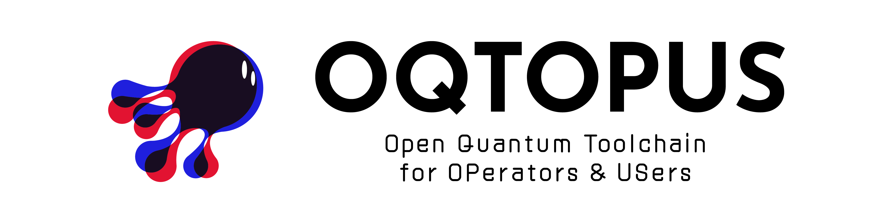

<!-- markdownlint-disable MD041 -->

# OQTOPUS CLI (Command Line Interface)

## Overview

**OQTOPUS CLI** is a command line interface for setting up and operating a local
OQTOPUS backend environment.

The CLI provides a single `oqtopus` command for the common lifecycle of a local
backend: create an environment, install backend component releases, start,
stop, and restart services, inspect status, and clean up unused installations.
It is designed to make OQTOPUS backend operation feel closer to familiar
developer tools such as package managers and service managers, while keeping
the underlying configuration files available for users who need to edit them.

With OQTOPUS CLI, users can:

- create a backend environment from the official template;
- install and update backend components such as `engine`, `tranqu`, and
  `gateway`;
- start, stop, and restart managed backend services including `core`, `sse_engine`,
  `mitigator`, `estimator`, `combiner`, `tranqu`, and `gateway`;
- check process status and backend environment information;
- keep installed component versions isolated under the local data directory;
- prepare runtime directories such as logs, PID files, and `sse_work` for local
  execution.

For v1.0.0, the CLI targets Linux and macOS local backend workflows. Windows
support, cloud-oriented commands, and the future Rust implementation are planned
as later work.

## Usage

If you are using OQTOPUS CLI for the first time, start here:

1. [Installation](./usage/installation.md)
2. [Quick Start](./usage/quick-start.md)
3. [Backend Environment](./usage/backend-environment.md)
4. [Configuration](./usage/configuration.md)

For day-to-day operations, see:

- [Managing Backend Components](./usage/backend-components.md)
- [Starting and Stopping Services](./usage/lifecycle.md)
- [Device Status](./usage/device-status.md)
- [Command Reference](./usage/command-reference.md)

For shell setup and problem solving, see:

- [Shell Completion](./usage/shell-completion.md)
- [Troubleshooting](./usage/troubleshooting.md)

## Developer Guidelines

- [Development Flow](./developer_guidelines/development_flow.md)
- [Setup Development Environment](./developer_guidelines/setup.md)
- [How to Contribute](./CONTRIBUTING.md)
- [Code of Conduct](https://github.com/oqtopus-team/.github/blob/main/CODE_OF_CONDUCT.md)
- [Security](https://github.com/oqtopus-team/.github/blob/main/SECURITY.md)

## Citation

Citation information is also available in the [CITATION](https://github.com/oqtopus-team/oqtopus-cli/blob/main/CITATION.cff) file.

## Contact

You can contact us by creating an issue in this repository or by email:

- [oqtopus-team[at]googlegroups.com](mailto:oqtopus-team[at]googlegroups.com)

## License

OQTOPUS CLI is released under the [Apache License 2.0](https://github.com/oqtopus-team/oqtopus-cli/blob/main/LICENSE).
